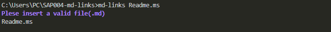
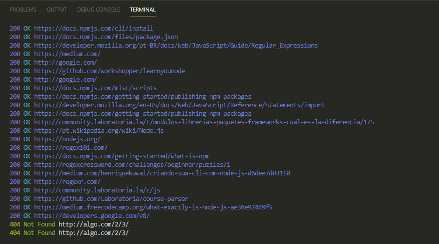

# Markdown Links

 É uma biblioteca que nos permite validar links, assim como obter suas estatisticas.

## Instalação 

npm install -g sjadriana/SAP004-md-links

## Extensão.md

Se o arquivo não for uma extensão .md (markdown), o programa não será executado e enviará uma mensagem de erro:

 

Caso contrário trará um Objeto com os Links 

## Validando links

 Quando o usuário solicitar, através do comando "md-lindks exemploFile.md --validate" será mostrando os links validados:

 ## Desinstalação 
  Para desinstalar "npm uninstall -g md-links"
 

## Implementações futuras:

 * Validação com estatisticas 
 * Testes

